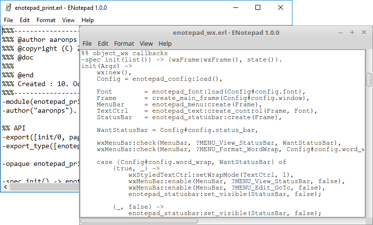

# enotepad
Clone of MS Notepad using Erlang (wxWidgets)



## Motivation

In the process of learning Erlang, I wanted to make some GUI application, so I
though *I will make a Notepad clone, after all it is just a text control...*
it wasn't.

Things learned:

* how to use wxWidgets, wx_object and Scintilla
  * using menus, status bar
  * custom dialogs and simple dialogs
  * printing on a printer
* how to make a wxWidgets application using OTP design principles.
* how to build _escripts_ and applications manually
* file handling, creating/removing directories
* dialyzer and types
* how to make releases with systools and with reltool

## Installation

This program is not inteded to be installed, its a learning tool.

Anyway, on Windows there is an installer, but for other systems you must build
from source.

## Building

This project uses an Emakefile and a custom `escript` to build, the idea behind
it is to understand how things are build in Erlang. The command used is `emaker`
and you can find it on the project root folder.

On windows run `emaker help`, on others `./emaker help`.

    available targets:
        all             - (default) runs make:all
        clean           - removes ebin
        rebuild         - cleans and build
        escript         - builds escript file for this system
        escript all     - builds escript file for all systems (not rebar style)
        escript windows - builds escript file for windows
        escript unix    - builds escript file for unix-like systems
        escript rebar   - builds escript file rebar style (windows file is small)
        escript exe     - same as 'escript rebar' but using .exe instead of .cmd
        dialyzer Type   - runs dializer, Type might be ebin(default) or src
        release systools- makes a release using systools
        release reltool - makes a release using reltool

For example `emaker escript` will build an _escript_ version of enotepad,
`emaker release reltool` will make a full release using reltool.

The output of `emaker` will be:
* ./ebin for normal build
* ./releases/escript for any of `escript X`
* ./releases/systool for `release systools`
* ./releases/reltool for `release reltool`

You could, if you so wish you can also run `erl -make` and will get the results
on ebin.

## Running

You can run enotepad in multiple ways: using Erlang shell, using the built
_escript_ and using a generated release.

### Using Erlang shell

Within a project folder run `erl -pa ebin` then in the Erlang shell you have
multiple options too, using main like the _escript_:
```
Eshell V8.1  (abort with ^G)
1> enotepad:main().
ok
2> enotepad:main(["some_file_name.txt"]).
ok
```

Using `start_link` which is used when running under supervisor, but you can use
too:
```
Eshell V8.1  (abort with ^G)
1> enotepad:start_link().
ok
2> enotepad:start_link("some_file_name.txt").
ok
```

Starting like an application:
```
Eshell V8.1  (abort with ^G)
1> application:start(wx), application:start(enotepad).
ok
2> application:set_env(enotepad, file, "some_file_name.txt").
ok
3> application:start(enotepad).     <<-- this will load some_file_name.txt
ok
```

When running like an application, you can stop also with
`application:stop(enotepad)` but this is not needed if you just close the
window.

### Using the _escript_

This way requires you to have a working installation of Erlang on the path, then
just run it by name with optional parameter:

```
> path/to/enotepad <file_name>
```

### Using a built release

This doesn't require Erlang as it already includes it, just run it by name like
the _escript_, the actual file you run is a facade to hide the erl parameters.

## @todo

Need to write a description of the knowledge acquired.
